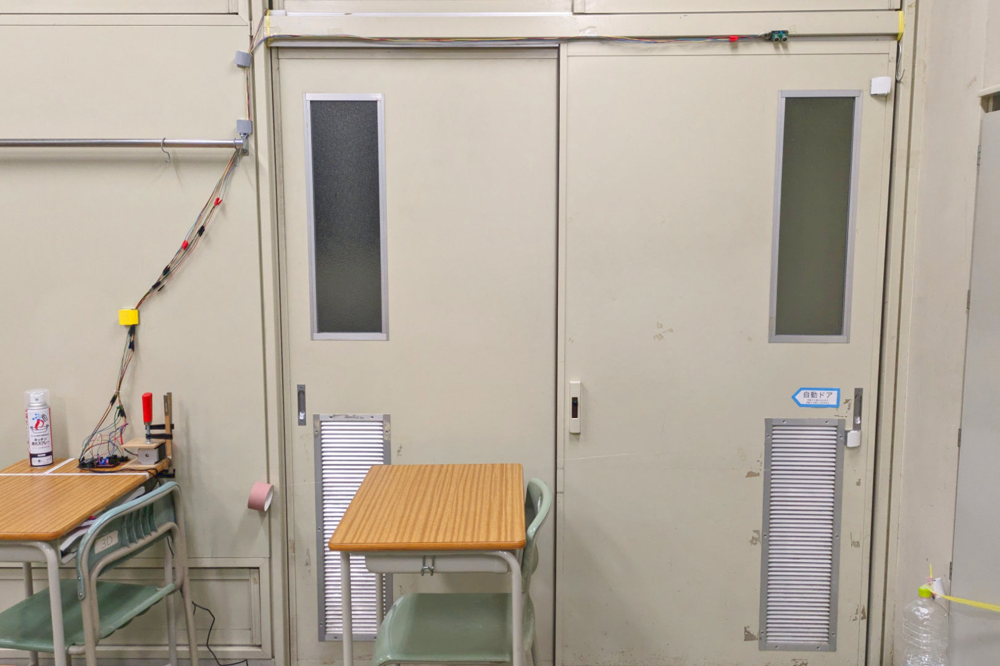
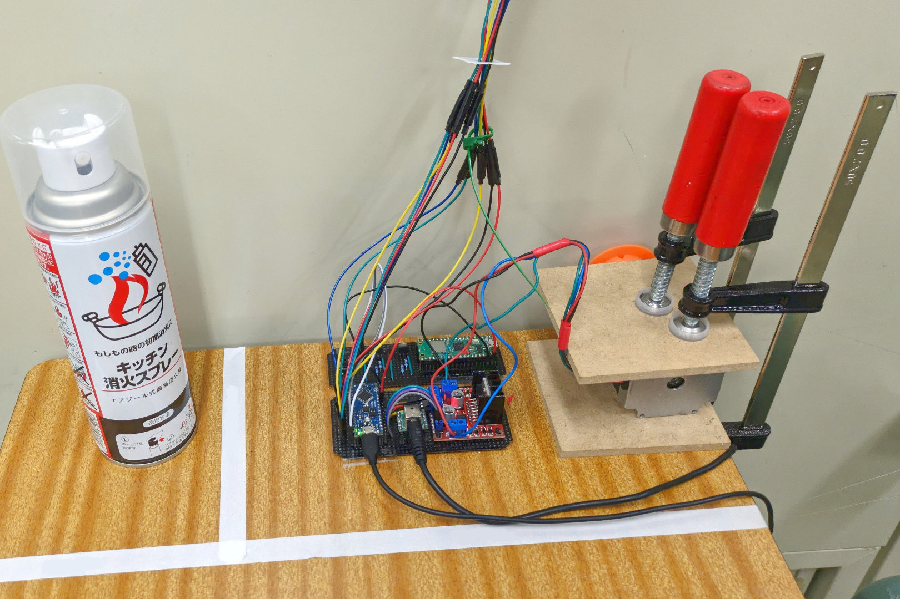
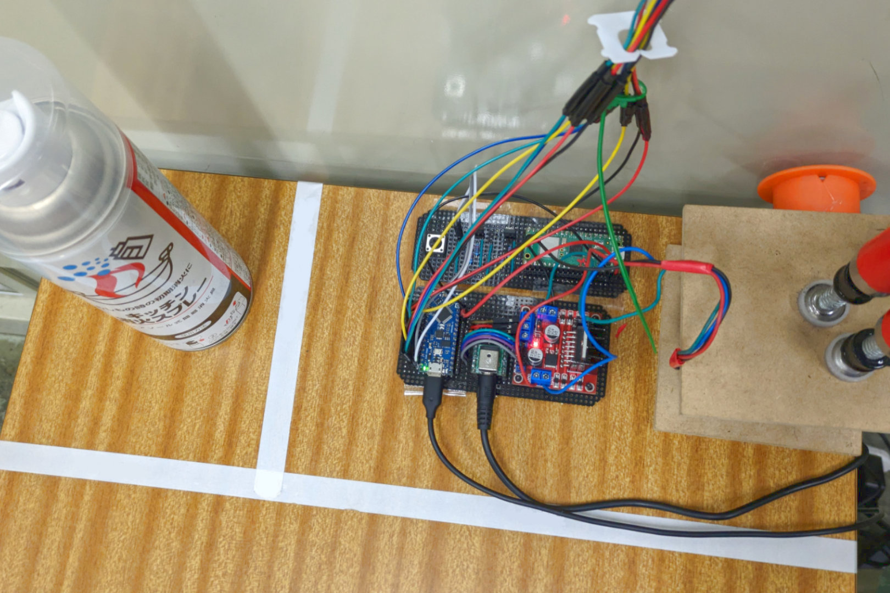
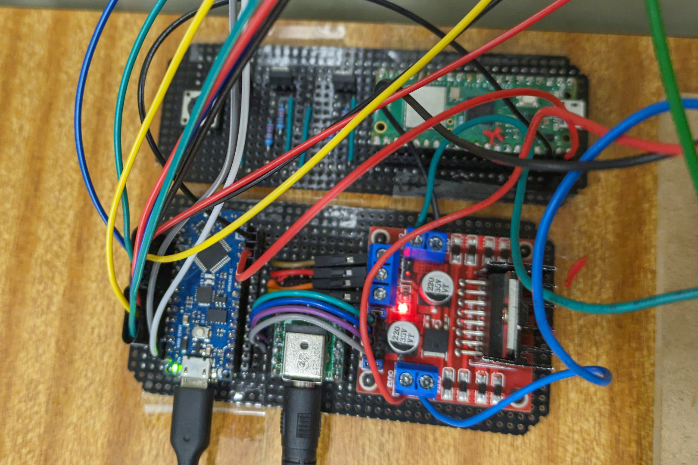
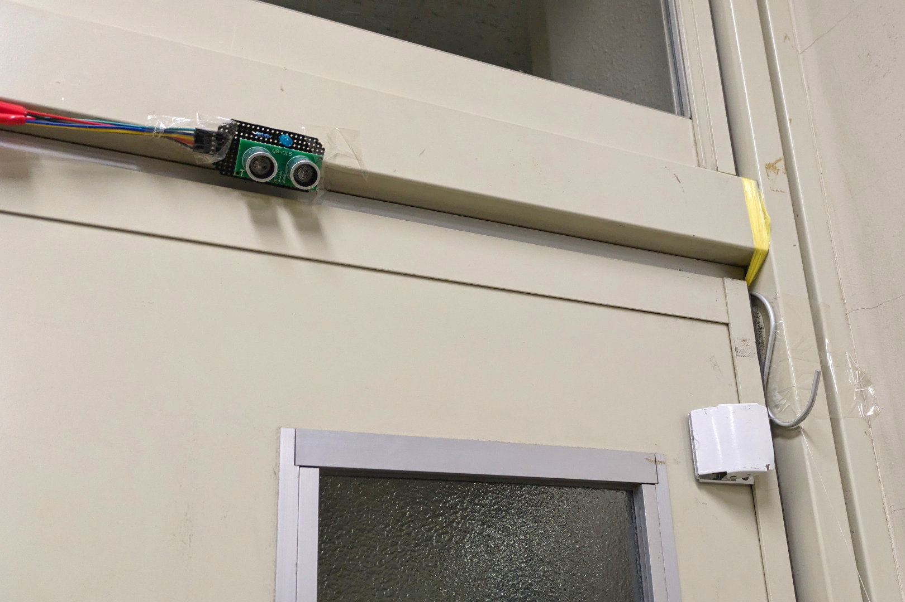
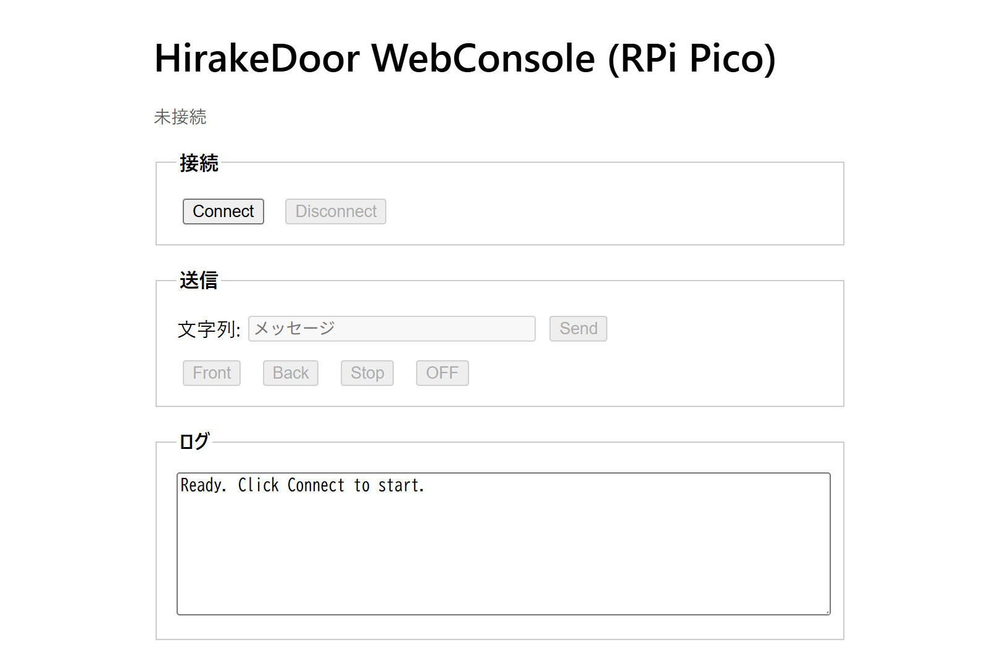
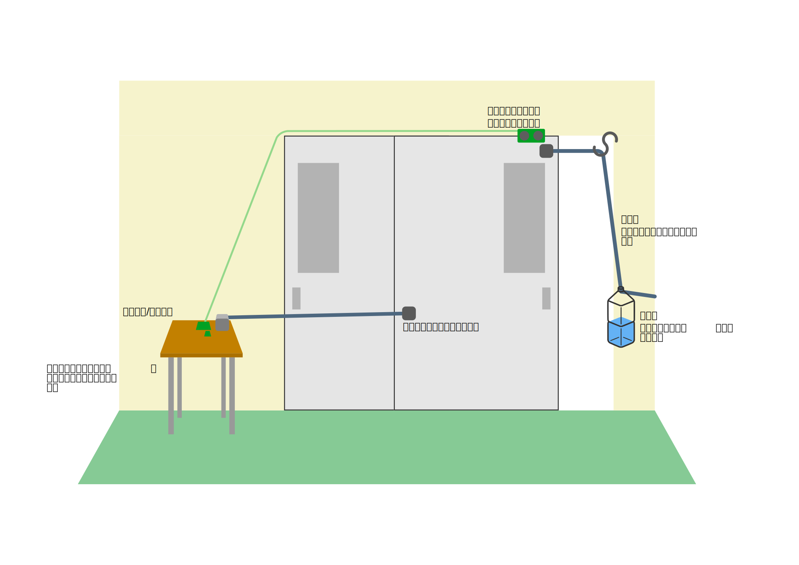
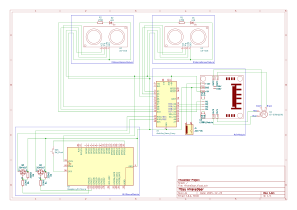

# ひらけドア (HirakeDoor)

教室ドアの自動化プロジェクト  
[PV映像(YouTube)](https://youtu.be/fkIhEhKD6Qc)

## 概要

教室にある横開きの扉を、センサーやモーターなどを用いて、自動ドア化するプロジェクト。  
距離センサーで人の接近を検知し、ステッピングモーターで扉を開閉する。  
閉じる際はおもりによる重力を利用することで、挟まれ事故などを防止している。  
Webインターフェースを用いて、BluetoothLowEnergy(BLE)経由で、手動による扉の開閉を行うこともできる。(BLEに対応するブラウザが必要)

### 背景

冬の教室で扉すぐ横の席は、扉を開きっぱなしにされると非常に寒い。  
だからといって毎回自分で閉めたり、閉めるようお願いするのも手間がかかる。  
そこでこのプロジェクトが始まった。  
第一段階として、扉におもりを取り付け、開けたら勝手に閉まるようなドアクローザー機構を作成。  
概ね好評だったものの、開けるのが重くなるなどの問題もあり、第二段階としてセンサーやモーターなどを用いた自動ドア化を行った。

### 安全対策

扉を閉じる力はおもりの重力のみを使うことで、挟まれた際のリスクを低減し、扉を手動でも開けられるようにした。

## ギャラリー

||||
|:--:|:--:|:--:|
||||
||||

## ソフトウェア構成

- [C++ (Arduino Nano Every)](software/arduino/hirake_door.ino)
- [MicroPython (Raspberry Pi Pico)](software/RPiPico/main.py)
- [HTML (Webインターフェース)](software/web/HirakeDoor.html)

## ハードウェア構成

### 概略図

### 主要パーツ

- マイコン
  - Arduino Nano Every
  - Raspberry Pi Pico
- ステッピングモーター
  - ST-57BYG076
- モータードライバー
  - L298N モジュール
- 超音波距離センサー
  - US-015

詳細は[hardware/parts.csv](hardware/parts.csv)を参照。

### 回路図

## クレジット

### プロジェクトメンバー

- M_Haruki
- bearkou
- mochi_kumo
- Mr.Chi

### Special Thanks

- 3D(78th)
